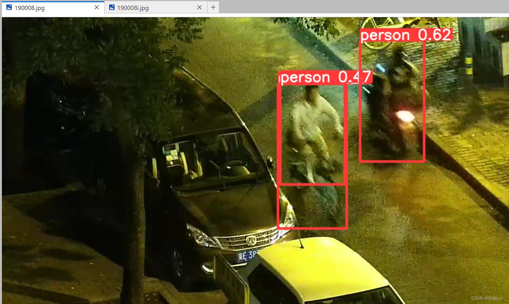

# YOLOv8-Multi-Modal-Fusion-Network-RGB-IR
## 一、参数说明
在YOLOv8源码的基础上，此代码新增参数如下：  
改为3即变为原YOLOv8模型,6则为RGB+红外,只能3或6其他通道数会报错，两个文件修改要保持一致
1. 训练配置文件：ultralytics/cfg/default.yaml
```
ch: 6 # 6 or 3
```
2. 模型配置文件：ultralytics/cfg/models/v8/yolov8.yaml
```
ch: 6 # 6 or 3
```

## 二、数据集准备
数据集文件夹需严格按下面命名：
```
|-datasets
    |-LLVIP700
        |-images
        |-image  # 额外的图片文件夹，放红外图
        |-labels
```
代码基于YOLOv8官方代码实现，除以上新增参数，训练、改模型等任何操作均与YOLOv8官方代码完全一致
## 三、训练/验证/检测
运行main.py即可  
提供了一个在LLVIP数据集上训练好的多模态预训练权重.pt  
提供了700张LLVIP数据集用来测试跑通


## 四、网络结构
1、前端融合


2、中间融合


3、后端融合（双路）


前端融合与单模态原模型对比，下图仅展示了前端融合网络，中间和后端融合均已实现，但不作展示：

原模型（单输入，3通道）


双模态（双输入，3+3=6通道）


三模态（三输入，3+3+3=9通道）

一、多模态数据集结构

                |-datasets
                        |-images
                                  |-train
                                            |-a.jpg
                                  |-val
                                            |-b.jpg
                        |-image  # 额外的图片文件夹，放红外图，名称与原图对应
                                  |-train
                                            |-a.jpg
                                  |-val
                                            |-b.jpg        
                        |-labels  # 双模态共用一个标签
                                  |-train
                                            |-a.txt
                                  |-val
                                            |-b.txt

二、训练结果
蓝色为双模态RGB+IR，红色为单模态RGB





